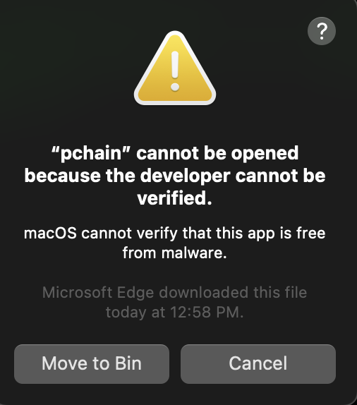

---
tags:
  - testnet 1.0
  - parallelchain light client
  - tutorial
---

# Installation

`Learning outcome`: _Setup and install `pchain` on your system._

## For Windows 

Download the compressed zip file from [https://cms.parallelchain.io/parallelchain-cli_win_x64_v0.1.0.zip](https://cms.parallelchain.io/parallelchain-cli_win_x64_v0.1.0.zip)

Unzip the file to extract the executable `parallelchain-cli_win_x64_v0.1.0.exe`. It is suggested to rename the executable to `pchain.exe` so that it becomes easier to follow this guide:


To open Command Prompt, type *WIN+R* and input `cmd`:


Head to the directory where `pchain.exe` is located via `cd`. For example, the executable is located at C:\Development:


Run the command `pchain.exe` to see if it launches:


Congratulations. You have successfully installed `pchain` and are ready to proceed to ["Configure `pchain` to communicate with the testnet"](#configure-pchain-to-communicate-with-the-testnet)

### For Powershell User

This section describes using `PowerShell` as the command line utility to install ParallelChain Light Client. 

Open up `PowerShell` using the `run` keyboard shortcut. That is *WIN+R* and type in `powershell` to proceed. 

Unzip the compressed zip file by `Expand-Archive`. Please specify the source path and destination path for your command parameters:

-  `<SOURCE_PATH>`: the directory where `parallelchain-cli_win_x64_v0.1.0.zip` is located.
-  `<DESTINATION_PATH>`: the directory you intend to install `pchain`. 

```PowerShell
Expand-Archive -LiteralPath 'C:\<SOURCE_PATH>\parallelchain-cli_win_x64_v0.1.0.zip' -DestinationPath 'C:\<DESTINATION_PATH>\parallelchain-cli_win_x64_v0.1.0.exe'
```

To switch the operating mode of `PowerShell` from a normal mode to administrator mode:
```PowerShell
Start-Process powershell -Verb runAs
```

Head to the destination directory where `parallelchain-cli_win_x64_v0.1.0.exe` is extracted:
```PowerShell
Set-Location C:\<DESTINATION_PATH>\
```

In the destination directory (`<DESTINATION_PATH>`), it is suggested to rename the binary to `pchain` so that it becomes easier to follow this guide:
```PowerShell
Rename-Item -Path 'parallelchain-cli_win_x64_v0.1.0.exe' -NewName 'pchain.exe'
```

Run the command `pchain` to see if it launches.
```PowerShell
pchain.exe
```
<details>
  <summary>To verify that the Light Client works</summary>
    pchain is now an executable from anywhere on your system
    ```bash
    verylight 0.1.0
    <Parallel Chain Lab>
    Parallel Chain Mainnet verylight
    ```
</details>

Congratulations. You have successfully installed `pchain` and are ready to proceed to ["Configure `pchain` to communicate with the testnet"](#configure-pchain-to-communicate-with-the-testnet)

## For Linux / macOS

In this section, most of the commands between the two operating systems are the same. If there are any differences, a
tab that states a command for a particular operating system will be shown as below:

=== "Linux"
    ```bash
    echo "This is a linux command"
    ```
=== "macOS"
    ```bash
    echo "This is a macOS command"
    ```

To download the precompiled compressed binaries, use:

=== "Linux"
    ```bash
    wget https://cms.parallelchain.io/parallelchain-cli_linux_v0.1.0.tar.xz
    ```
=== "macOS"
    ```bash
    curl -O https://cms.parallelchain.io/parallelchain-cli_mac_x86_v0.1.0.tar.xz
    ```

To extract the client program, head to the directory where the downloaded file `parallelchain-cli_linux_v0.1.0.tar.xz` or  `parallelchain-cli_mac_x86_v0.1.0.tar.xz` is located and extract via `tar`:
```bash
tar -xvf parallelchain-cli_linux_v0.1.0.tar.xz 
```

Rename the client program to `pchain` so that it becomes easier to follow this guide:
```bash
mv parallelchain-cli_linux_v0.1.0 pchain
```

Run the command `pchain` to see if it launches.
=== "Linux"
    ```bash
    ./pchain
    ```
=== "macOS"
    ```bash
    ./pchain
    ```

    !!! Tip
        **For macOS users**: _Newer versions of macOS contain extra security verification steps configured by default. This is called [GateKeeper](https://support.apple.com/en-gb/guide/security/sec5599b66df/web). This usually happens when you download the binaries from a browser instead of using the `curl` tool as mentioned in the previous step. In case you found a message like this when calling `pchain`_:
        ```bash
        ./pchain
        ```
        

        then you can remove macOS' "GateKeeper" attributes from `pchain` by this command and run pchain as normal
        ```bash
        sudo xattr -rd com.apple.quarantine ./pchain
        ```

        This is an elevated action, so you will need to enter your password to continue. `pchain` can now be used as normal.

<details>
  <summary>To verify that the Light Client works</summary>
    ```bash
    verylight 0.1.0
    <Parallel Chain Lab>
    Parallel Chain Mainnet verylight
    ```
</details>

Congratulations. You have successfully installed `pchain` and are ready to proceed to ["Configure `pchain` to communicate with the testnet"](#configure-pchain-to-communicate-with-the-testnet)

!!! Tip

    You might want to store `pchain` in a directory of your choice so that it is easier to follow the commands in the tutorial. For example, we created a folder in our home directory called parallelchain_client:
    ```bash
    $ mkdir -p /home/my_user/parallelchain_client
    $ cp pchain /home/my_user/parallelchain_client/
    $ cd /home/my_user/parallelchain_client
    $ ./pchain
    ```

    So from now on, when you see a command like this in linux/macOS:
    ```bash
    ./pchain
    ```

    It means that `pchain` shall be executed from the directory you stored `pchain` in.


## Configure `pchain` to communicate with the testnet

To verify that our testnet is live and running, please make sure that the following URL is working by clicking on the link below:

* [https://testnet1.digital-transaction.net](https://testnet1.digital-transaction.net) 


If the link above is working, type the command below to configure `pchain` to communicate with the testnet:
=== "Linux / macOS"
    ```bash
    ./pchain set config --target-address https://testnet1.digital-transaction.net
    ```
=== "Windows"
    ```PowerShell
    pchain.exe set config --target-address https://testnet1.digital-transaction.net
    ```

This command will write a config.json file in `$HOME/.parallelchain/pchain_cli/config.json`. It only needs to be executed once.