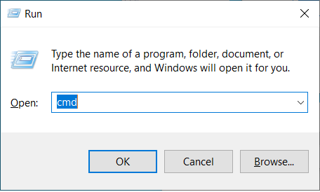

---
tags:
  - testnet 1.0
  - parallelchain light client
  - tutorial
---

# Installation

`Learning outcome`: _Setup and install `pchain` on your system._

## For Windows 

Download the compressed zip file from [https://cms.parallelchain.io/parallelchain-cli_win_x64_v0.1.0.zip](https://cms.parallelchain.io/parallelchain-cli_win_x64_v0.1.0.zip)

Unzip the file to extract the executable `parallelchain-cli_win_x64_v0.1.0.exe`. It is suggested to rename the executable to `pchain.exe` so that it becomes easier to follow this guide:


To open Command Prompt, type *WIN+R* and input `cmd`:



Head to the directory where `pchain.exe` is located via `cd`. For example, the executable is located at C:\Development:


Run the command `pchain.exe` to see if it launches:


### For Powershell User

This section describes using `PowerShell` as the command line utility to install ParallelChain Light Client. 

Open up `PowerShell` using the `run` keyboard shortcut. That is *WIN+R* and type in `powershell` to proceed. 

Unzip the compressed zip file by `Expand-Archive`. Please specify the source path and destination path for your command parameters:

-  `<SOURCE_PATH>`: the directory where `parallelchain-cli_win_x64_v0.1.0.zip` is located.
-  `<DESTINATION_PATH>`: the directory you intend to install `pchain`. 

```PowerShell
Expand-Archive -LiteralPath 'C:\<SOURCE_PATH>\parallelchain-cli_win_x64_v0.1.0.zip' -DestinationPath 'C:\<DESTINATION_PATH>\parallelchain-cli_win_x64_v0.1.0.exe'
```

To switch the operating mode of `PowerShell` from a normal mode to administrator mode:
```PowerShell
Start-Process powershell -Verb runAs
```

Head to the destination directory where `parallelchain-cli_win_x64_v0.1.0.exe` is extracted:
```PowerShell
Set-Location C:\<DESTINATION_PATH>\
```

In the destination directory (`<DESTINATION_PATH>`), it is suggested to rename the binary to `pchain` so that it becomes easier to follow this guide:
```PowerShell
Rename-Item -Path 'parallelchain-cli_win_x64_v0.1.0.exe' -NewName 'pchain.exe'
```

Run the command `pchain` to see if it launches.
```PowerShell
pchain.exe
```
<details>
  <summary>To verify that the Light Client works</summary>
    pchain is now an executable from anywhere on your system
    ```bash
    verylight 0.1.0
    <Parallel Chain Lab>
    Parallel Chain Mainnet verylight
    ```
</details>

Congratulations. You have successfully installed `pchain` and are ready to proceed to the following sections.

## For Linux

To download the precompiled compressed binaries using the terminal command:
```bash
wget https://cms.parallelchain.io/parallelchain-cli_linux_v0.1.0.tar.xz
```

To extract the client program, head to the directory where the downloaded file `parallelchain-cli_linux_v0.1.0.tar.xz` is located and extract via `sudo tar`:
```bash
sudo tar -xvf parallelchain-cli_linux_v0.1.0.tar.xz --directory /usr/bin 
```
**`sudo` is for privileged access while `tar` is for file extraction. Please see further details below:**

<details>
  <summary>Administrative Action in Linux</summary>
When you add a "sudo" keyword to the front of a command in linux, you need to enter your password like this:
```bash
[sudo] password for my_user:
```
and press enter to continue with the operation.
</details>

To rename the client program to `pchain` so that it becomes easier to follow this guide:
```bash
sudo mv /usr/bin/parallelchain-cli_linux_v0.1.0 /usr/bin/pchain
```

Run the command `pchain` to see if it launches.
```bash
pchain
```
<details>
  <summary>To verify that the Light Client works</summary>
    `pchain` is now an executable from anywhere on your system
    ```bash
    verylight 0.1.0
    <Parallel Chain Lab>
    Parallel Chain Mainnet verylight
    ```
</details>

Congratulations. You have successfully installed `pchain`.